# Walkthrough: circumcision articles, fallacy_catalog run (2026-10-08)

Every step of this benchmark, in order, with what was done, who or what did it, the key number and the chart. It does not repeat the methods; each step links to its method or detail file. Back to the [run README](README.md). The longer read of the results is [ANALYSIS.md](ANALYSIS.md).

**Read with these caveats.**

- Every judgment below was made by an **AI model, not a person**: the fallacy flags, the pro/anti labels, the dependence check, the recheck, the topic tags, the what-if tags and the step-10 check of non-medical keyword hits. Rule scripts only counted, matched and checked quotes.
- **Not blind.** Reviewers 2 and 3, the pass-3 checkers and all the taggers started from a conversation that already knew earlier results. Reviewer 1 is the only fully uninfluenced read.
- **Flags are leads, not verdicts.** A flag says a step of reasoning fails a catalog entry, not that the conclusion is false. Keeping all points means not flagged, not proven true.
- **Pro only after step 5.** Steps 6 to 10 cover the male circumcision pro arguments only. Anti arguments were checked only in step 5 and were not put through pass 2 or pass 3, so comparing pro and anti after pass 3 is tilted against pro.

## 1. Snapshots

**What:** the 58 circumcision-related Grokipedia articles (39 male circumcision, 19 FGM) were saved as they appeared on 2026-10-01, and nothing was fetched again for this run. **Who:** a plain HTTP fetch (curl) and a text extraction; no model judgment. **Key number:** 58 articles, 13,199 prose sentences (8,778 male circumcision, 4,421 FGM).

Details: [ARTICLE_LIST.md](../../ARTICLE_LIST.md), [SNAPSHOT_INDEX.md](../../SNAPSHOT_INDEX.md).

## 2. Claim and source check (citation markers only, so far)

**What:** this run counted citation markers against each article's saved source list. It did **not** yet check each claim against what its cited source says; that claim-by-claim check (steps 2 and 3 of the [repo README](../../../../README.md)) is still to be done for this topic. **Who:** a rule script (`scripts/citation_stats.py`). **Key number:** 4,658 of 13,199 sentences (35.3%) carry no citation marker; two articles have broken source lists.

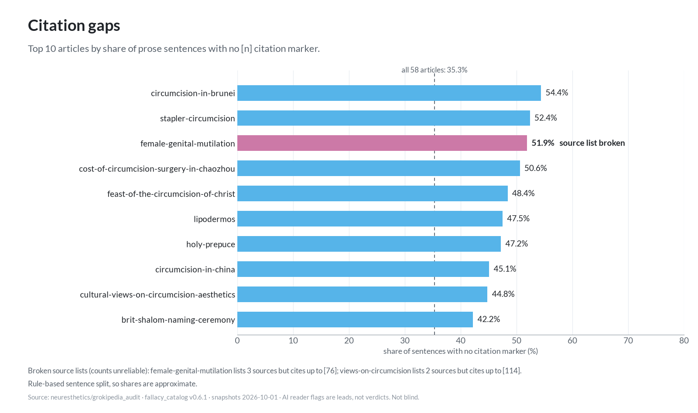

Details: [README.md, "Citation counts"](README.md#citation-counts), [ANALYSIS.md, "Citation hygiene"](ANALYSIS.md#citation-hygiene).

## 3. Three reviewers' fallacy flags

**What:** each reviewer read all 58 articles in full and flagged passages where the article's own reasoning meets every condition of a [fallacy_catalog](https://github.com/neuresthetics/fallacy_catalog) v0.6.1 entry. Every quote was checked by script against the snapshot. **Who:** three separate AI agent sessions (Reviewers 1, 2 and 3). **Key number:** 87 rows from Reviewer 1, 64 from Reviewer 2 and 121 from Reviewer 3.

Details: [README.md, "What was done"](README.md#what-was-done), [scripts/reading_notes.md](scripts/reading_notes.md).

## 4. Comparison and charts 01–04

**What:** the three sets of flags were compared by side and by article, and matched to each other where their quotes overlap. **Who:** rule scripts (`scripts/compare_reviewers.py`, [`tools/make_charts_2026_10_08.py`](../../../../tools/make_charts_2026_10_08.py)). **Key numbers:** for every flawed argument helping the anti side, the reviewers found 2.3, 5.25 and 1.51 helping the pro side. 33 passages were flagged by all three reviewers (25 for the same side).

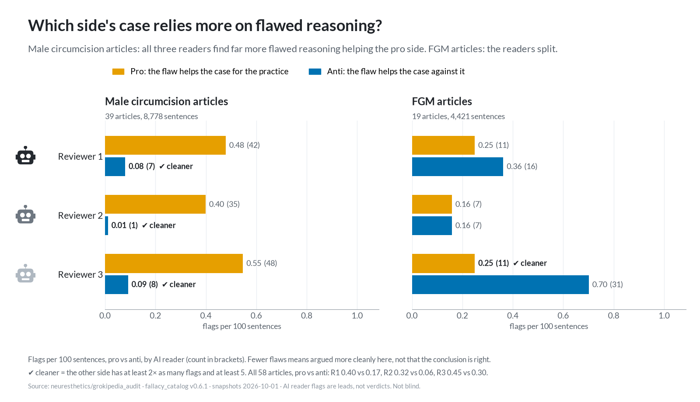

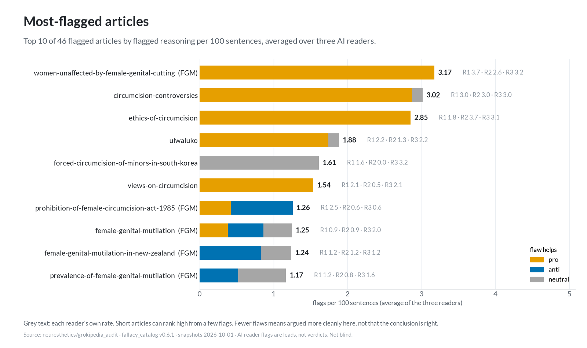

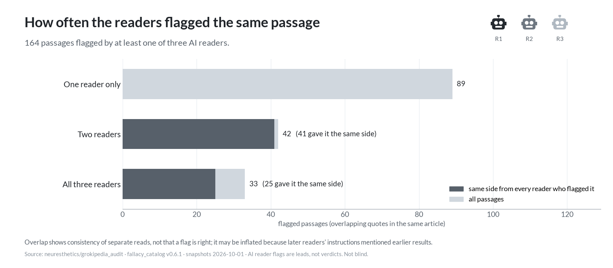

Chart 03 is shown under step 2. Details: [README.md, "Second reviewer and overlap"](README.md#second-reviewer-and-overlap) and ["Third reviewer and three-way overlap"](README.md#third-reviewer-and-three-way-overlap), [ANALYSIS.md](ANALYSIS.md).

## 5. Survival scoring and chart 05

**What:** every sentence was labeled pro, anti or not an argument. Each argument starts with 3 points and loses 1 for each reviewer that flagged it. **Who:** an AI model in 9 separate labeling sessions split by article (the labelers did not see the flags); the scoring is a rule script. **Key number:** in the male circumcision articles, 93.7% of pro arguments (910 of 971) and 99.5% of anti arguments (724 of 728) kept all 3 points. In the FGM articles: 96.7% pro, 97.7% anti.

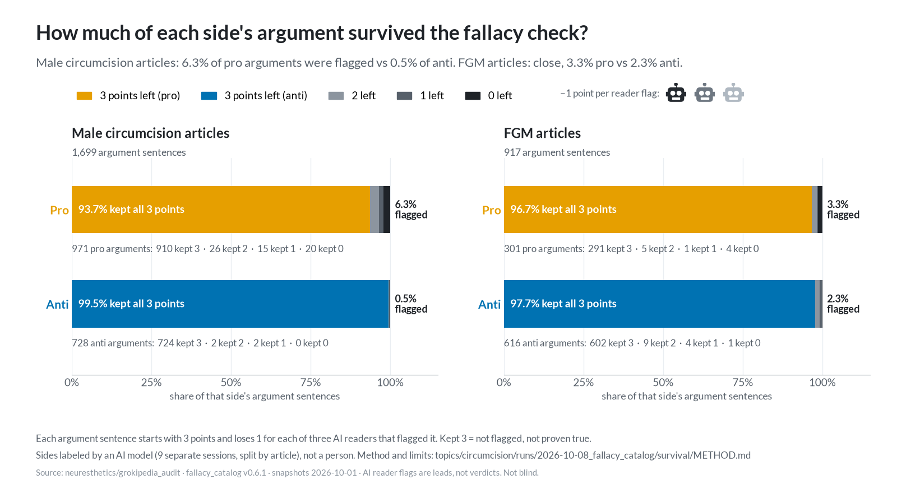

Details: [survival/METHOD.md](survival/METHOD.md), [survival/LABEL_PROMPT.md](survival/LABEL_PROMPT.md).

## 6. Flagged pro arguments by type and chart 06

**What:** the male circumcision pro arguments that lost at least one point were sorted by the kind of flaw the reviewers named, using the catalog's own categories, with mechanics, verbatim quotes and counters. **Who:** a rule script over the reviewers' flags; no new model judgment. **Key number:** 61 sentences; 28 (46%) are mainly off-point reasons and 20 (33%) unearned or clashing premises.

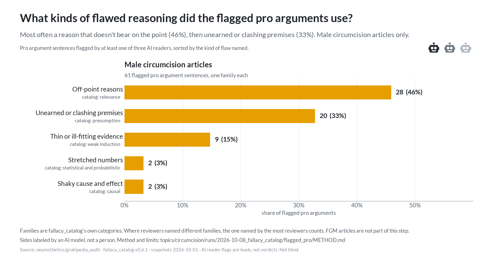

Details: [flagged_pro/FLAGGED_PRO.md](flagged_pro/FLAGGED_PRO.md), [flagged_pro/METHOD.md](flagged_pro/METHOD.md).

## 7. Dependency pass (pass 2), pass-3 recheck and chart 07

**Pass 2, what:** each surviving pro argument lost 1 point for every flagged pro argument it uses as a premise. A rule pre-filter picked 490 pairs to judge. **Who:** one AI model session. **Key number:** 25 of 951 lost a point; full points went from 910 to 888.

**Pass 3, what:** the 949 pro arguments with at least 1 point left were checked again, fresh, against the catalog, the same way the reviewers flagged. **Who:** five AI model sessions. **Key number:** 8 lost a point; 883 of 971 (90.9%) keep all 3 points.

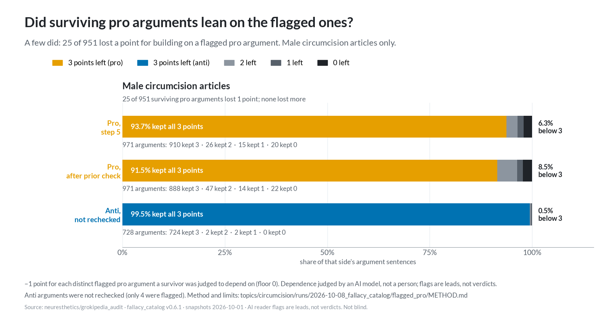

Details: [flagged_pro/dependency/DEPENDENCIES.md](flagged_pro/dependency/DEPENDENCIES.md), [flagged_pro/recheck/RECHECK.md](flagged_pro/recheck/RECHECK.md), [flagged_pro/METHOD.md](flagged_pro/METHOD.md#second-layer-dependence-on-flagged-priors).

## 8. Topic tagging and chart 08

**What:** each of the 883 pro arguments with all 3 points after pass 3 was tagged with the one kind of support it relies on. One type per sentence, so mixed sentences are forced into one type. **Who:** four separate AI model sessions; a keyword count (rule script) as a cross-check. **Key number:** 667 (75.5%) rest on medical or scientific data. The keyword tag matched the model's tag for 82.4% of sentences.

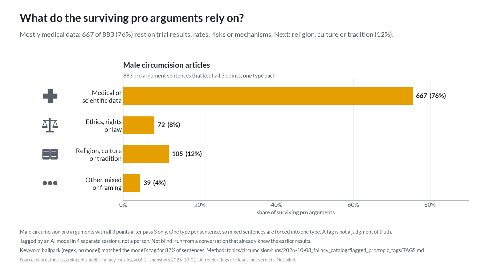

Details: [flagged_pro/topic_tags/TAGS.md](flagged_pro/topic_tags/TAGS.md), [flagged_pro/METHOD.md](flagged_pro/METHOD.md#what-the-surviving-pro-arguments-rely-on-topic-tags).

## 9. What-if checks: HIV/STI and cancer, charts 09 and 10

**Where the idea came from.** The HIV/STI check was prompted by two posts on X. Their text, verbatim (each also attaches an image; the first links a @statsglobe post). Neither cites a study, and this audit takes no position on them:

- [@Joseph4GI, 2026-10-06](https://x.com/joseph4gi/status/2107471990848381126): "Fun fact; STD rates are highest in circumcising countries, including the US."
- [@Intactivisme_Fr, 2026-09-26](https://x.com/intactivisme_fr/status/2103959873621025135): "Circumcision does NOT give you protection against HIV or other STDs. Foreskin is a mucous membrane that actually protects your genitals from getting anything, just like eyelids or nails or the lips."

The cancer check was a second what-if, raised by the repo owner, questioning cancer prevention as a reason.

**What:** two what-if passes over the 667 medical arguments from step 8. A tag means "depends on the claim", not that the claim is wrong; this audit did not check either claim. HIV/STI: all 667 tagged, no keyword prefilter (arguments tagged E, R or O in step 8 were not checked). Cancer: prefiltered to the 210 with a cancer, HPV or cervical keyword within two sentences; one relying on cancer only through "these benefits" outside that window is missed. **Who:** AI model sessions, three for HIV/STI and two for cancer, run from a conversation that already knew the earlier results, so not blind; keyword counts (rule scripts) as cross-checks. **Key numbers:** 254 of 667 (38.1%) rest on the HIV/STI claim; 35 rest on cancer, 8 of them also on HIV/STI; together 281 of 667 (42.1%), or 31.8% of all 883 surviving pro arguments.

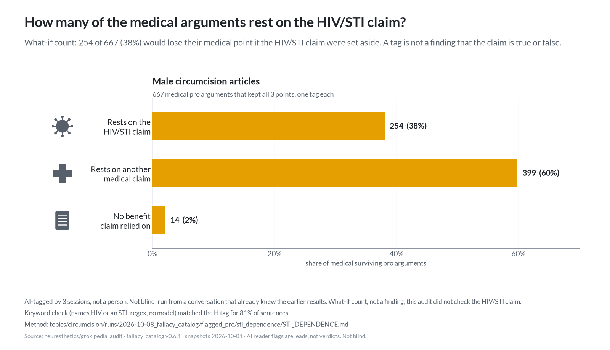

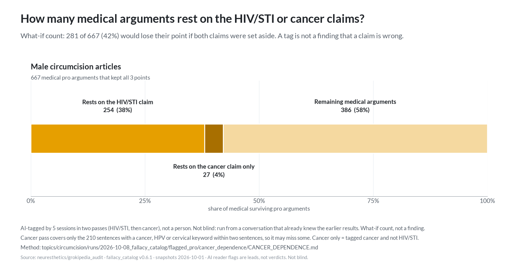

Details: [flagged_pro/sti_dependence/STI_DEPENDENCE.md](flagged_pro/sti_dependence/STI_DEPENDENCE.md), [flagged_pro/cancer_dependence/CANCER_DEPENDENCE.md](flagged_pro/cancer_dependence/CANCER_DEPENDENCE.md), [flagged_pro/METHOD.md](flagged_pro/METHOD.md#what-if-checks-do-the-medical-arguments-rest-on-the-hivsti-or-cancer-claims).

## 10. Total what-if: how much of the pro side is left, chart 11

**What:** Jason asked how much of the pro side is invalidated if three points are taken as true: (1) circumcision gives no protection against HIV or other STDs; (2) STD rates are higher in circumcising countries; (3) cancer prevention is not a valid reason. This step adds up earlier results for all 971 male pro arguments; it does not change them. Each argument is counted once: already flagged by the audit (lost a point at step 5, pass 2 or pass 3) first, then HIV/STI, then cancer only, then the rest by topic tag. Premise 2 is not counted separately, because it adds nothing to premise 1 here. **Who:** a rule script, using the AI tags from steps 8 and 9; plus one AI model session that checked the 14 non-medical survivors naming HIV, an STI or cancer (not blind). **Key numbers:** already flagged 88 (9.1%); set aside under the what-if 281 (28.9%); together 369 (38.0%). Not invalidated 602 (62.0%): other medical claims 386, religion or culture 105, ethics or law 72, other 39. Of the 14 non-medical keyword hits, 2 rest on the HIV claim; they are reported, not added.

**Key caveat:** this is a what-if, not a finding. Premise 1 contradicts the three randomized trials the articles cite (Auvert 2005, Bailey 2007, Gray 2007), which the `circumcision-and-hiv` article says later Cochrane reviews rated at low risk of bias; this audit did not check either side, so the result holds only if the premises hold.

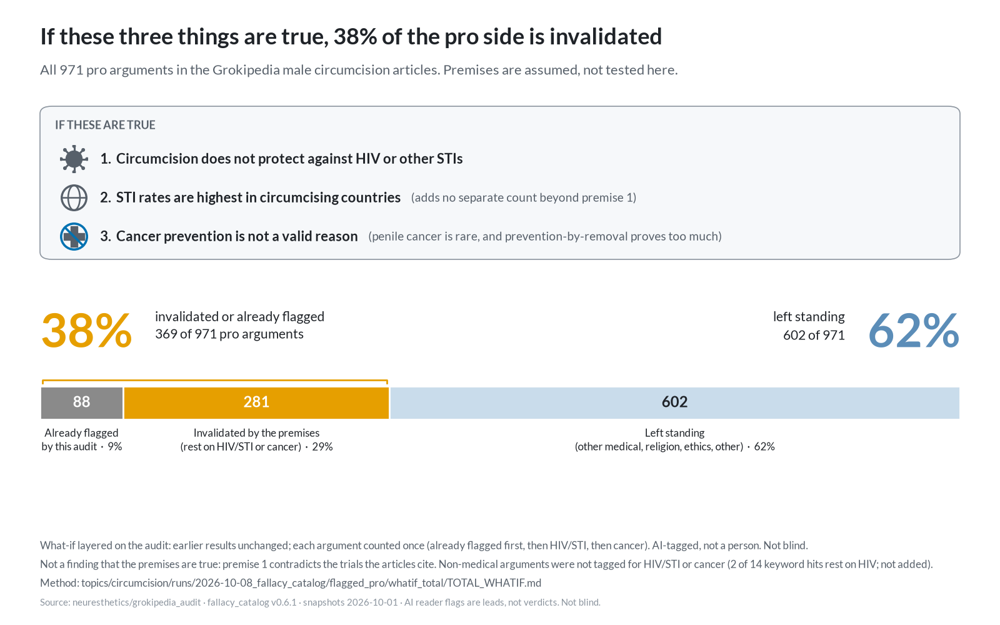

Details: [flagged_pro/whatif_total/TOTAL_WHATIF.md](flagged_pro/whatif_total/TOTAL_WHATIF.md), [flagged_pro/METHOD.md](flagged_pro/METHOD.md#total-what-if-how-much-of-the-pro-side-is-left).

## Note on chart 11 (appended)

Chart 11 was redrawn so a reader sees the what-if at a glance. Its title is now "If these three things are true, 38% of the pro side is invalidated", and it lists the three premises in a box: (1) circumcision does not protect against HIV or other STIs; (2) STI rates are highest in circumcising countries (adds no separate count beyond 1); (3) cancer prevention is not a valid reason (penile cancer is rare, and prevention-by-removal proves too much). Premises are assumed, not tested here. Earlier text that calls it "What-if: how much of the pro side is left" refers to the same chart. The numbers are unchanged: 88 already flagged, 281 invalidated under the premises, 602 left.
